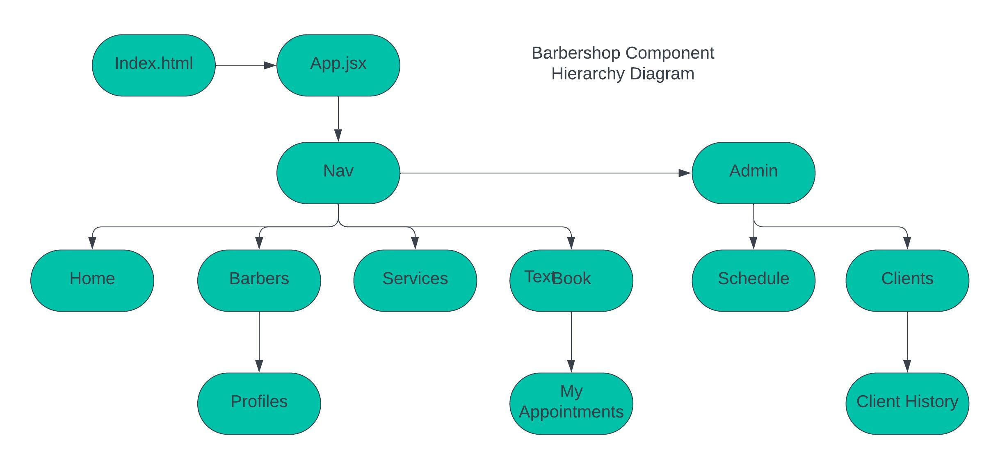
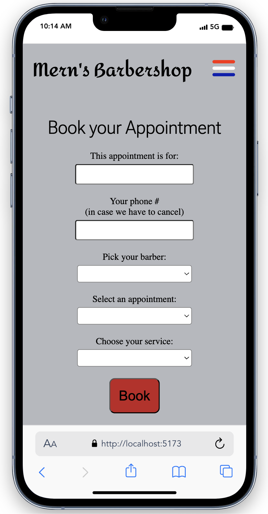

# Barbershop 
### Project Started: 2024/05/09
### By: Paul Burgess
#### [LinkedIn](https://www.linkedin.com/in/paul-burgess-a11154181/) - [GitHub](https://github.com/pauljburgess)

Mern's Barbershop App was created as a capstone project for my GA Bootcamp. Built using a full MERN stack and mobile-first thinking, it allows a Mom-and-Pop style barbershop to create services, barbers, and appointments, and accept online bookings.

***

### **Description**
As stated above, the goal for this app was actually pretty simple: let clients book their haircuts online, with the barber/stylist of their choosing. To accomplish this I wanted owners to be able to:
- Add Barbers to the website
- Add service options
- Create appointment slots for their barbers
- View a schedule for each barber
- Update and remove barbers/services/appointments as needed

For the clients, the goals were:
- Be able to book a haircut
- EITHER, be able to view your bookings online
- OR get an email/text confirmation of your booking

The backend of this project was created in a separate repository, and can be seen [here](https://github.com/pauljburgess/Barbershop-back). 

---

### **Technologies Employed**

- React
- JavaScript
- HTML 
- CSS
- Node
- Express
- Mongoose
- MongoDB
- Heroku

---

### **Getting started**

Exploring this app is simple. The app was deployed on Heroku, and can be seen [here](https://mernsbarbershop-b18f56107f65.herokuapp.com/). Admin credentials will be needed to login and explore admin features.

---
### **Diagrams**

##### ERD Drawing

##### Component Hierachchy Diagraom

---
### **Wireframes**
##### Home Page

##### Booking Page

##### Barbers Index

---

### **Screenshots**
##### Home Page

##### Booking Page

##### Barbers Index (admin)

---1cc
### Project planning

I used a [Trello](https://trello.com/b/jiwbf0Ss/ga-capstone-barbershop) board during development of this app.

---
### **Future Updates**

- [ ] Add a scheduling API
- [ ] Add a 'I don't care who does my hair' option
- [ ] Add a Client profile and history (see Compoent Hierarchy Diagram)

---
### **Credits**

[This](https://kenudeh.hashnode.dev/how-to-build-a-responsive-navigation-menu-with-react) tutorial by Ken Udeh was very helpful in creating the responsive mobile menu.

The [General Assembly](generalassem.ly) lesson on implimenting Auth was followed to create the login feature on this app.